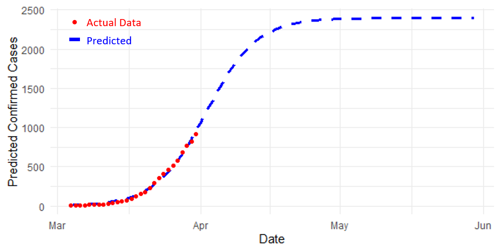

## When can we get out?

**Disclaimer: This work has very little scientific contributions and, of course, cannot help with any decisions of government or public health
authorities. It is just for fun and self-comforting.**

#### Background
I was a bit bored when self-isolating at home because of the COVID-19 and wondered if I could predict the end of the shutdown in Victoria (VIC, Australia) through the current data available. Therefore, my eagerness to get back to normal life led to this project.

#### Basic Idea
The basic idea is to take the data of new cases per day from provinces in China and the dates of government actions (Stage 1 and Stage 2) as the predictor. We assume the data of new cases per day follows [logistic curve](https://en.wikipedia.org/wiki/Logistic_function) (and exclude the ones that do not follow it because, for example, there are many imported cases). In other words, the main objective is to predict the logistic curve based on the new cases per day data (can be an arbitrary number of days) and government actions. Here, Stage 1 was defined as the time when the Level 1 emergency response began, and Stage 2 was defined as the time when 95% of cities had implemented transmission control measures [3].

#### Calculator
Please refer to the [R script](Model.R).

#### Findings
* The slope (rate of change) of the new cases per day in Stage 1 and Stage 2 correlates well with the slope at the inflection point (the date when the growth rate starts slowing down). The R values are 0.93 and 0.94, correspondingly.
* There is a low negative correlation (R = -0.41) between the steepness of the logistic curve and the earliness of starting Stage 1.
* Other variables do not correlate well with each other. However, it seems that the time between the inflection point and Stage 1 usually is 8-13 days, and the time between the inflection point and Stage 2 is roughly 0-6 days.

#### An Inaccurate Estimation
We then fit the VIC data (from Mar 4 to Mar 31) into the model. Stage 1 date was not used, and Stage 2 mentioned previously was fitted using the time of Stage 3 in VIC, where staying at home was enforced. The models predict the curve below.

It looks like we can only get out until May (sigh!)

#### Data Source
1. https://github.com/CSSEGISandData/COVID-19
2. https://github.com/covid-19-au/covid-19-au.github.io
3. Huaiyu Tian, Yonghong Liu, Yidan Li, Chieh-Hsi Wu, Bin Chen, Moritz UG Kraemer, Bingying Li et al. "The impact of transmission control measures during the first 50 days of the COVID-19 epidemic in China." medRxiv (2020).
